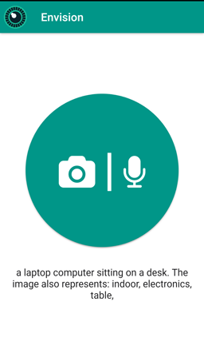

# Envision
Envision is a multi-purpose assistant app to help visually impaired in their daily activities. The aim is to create an unique interaction between the device and human in an user friendly manner.

## Platforms 
- Android
- iOS

## Services
- Apache Cordova
- Microsoft Cognitive Services
- [Multimodal Compact Bilinear Pooling for VQA](https://github.com/akirafukui/vqa-mcb)

## Screenshot
